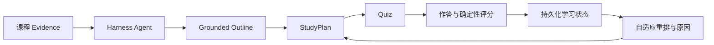
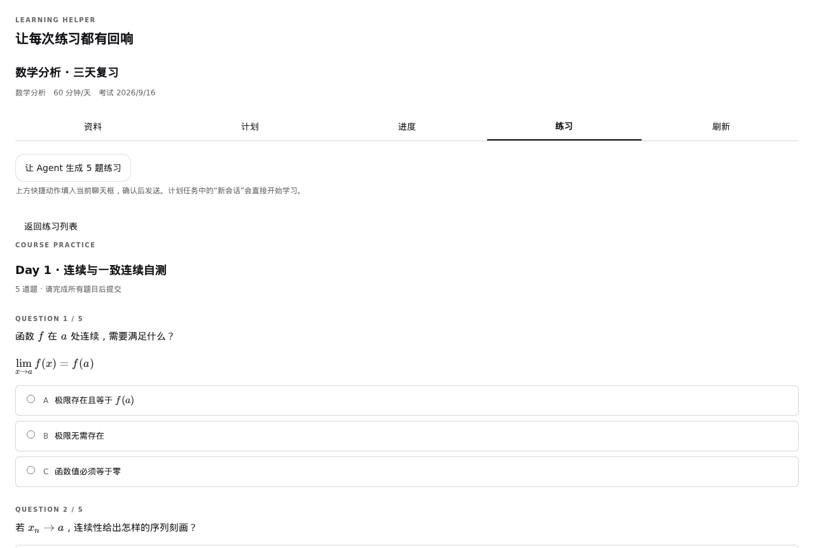
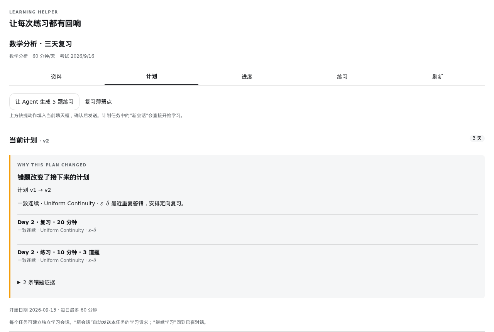

# Learning Helper

把今天的错题，变成明天更有针对性的学习计划。

**One Workspace = one Learning Project。** 面向本科生 3–14 天数学分析/微积分备考的学习 Agent。它读取上传的课程资料，生成有出处的解释、课程结构、计划与练习；答题结果持续更新学习状态，并实际调整后续任务。



核心演示：一致连续连续答错两题 → **Weak** → 复习队列 → 计划 **v1 → v2** → 明天增加 **20 分钟复习 + 3 道针对题**。学生能够看到计划为什么改变。

<p>
  
  
</p>

v0.1 的真实 Harness 浏览器截图；课程与答题数据来自确定性演示 fixture。v0.2 验收状态见 CURRENT。

## 学习体验

- 在当前 Harness Workspace 启用学习项目；切换 Workspace 自动切换独立资料和学习状态。
- TXT/Markdown canonical assets；PDF.js 本地快速解析、不可变 PDF archive、真实页码引用。
- 自动/高精度解析复用 Harness image-capable model；未声明视觉能力时明确禁用，不伪装成功。
- 可选外部官方 MinerU protocol 2：异步转长期 Markdown，原子切换当前 representation，历史引用持续可读。
- 七个 session-bound tools 完成检索、阅读、grounded outline/plan/quiz、原件按需核验；Agent 不提交 courseId 或路径。
- 原生 Learning 面板：计划、进度、交互 MCQ、解释/刷新恢复、任务独立学习会话。
- 题目、选项、解析和计划支持 Markdown/LaTeX 数学公式；长公式可在窄屏内横向滚动。
- 确定性评分与可解释重排；双击和丢失响应重试不重复记账。

功能证明与最终模型/部署验收分别记录在 [验收矩阵](docs/acceptance/matrix.md) 和 [当前状态](docs/CURRENT.md)。普通自动测试不调用外部模型。

## 快速开始

v0.2 目前保留在 `feat/workspace-v02` 分支，尚未发布 tag；默认分支与 `v0.1.0` 仍用于已发布版本。运行壳与部署文件在 [Develata/learning-helper](https://github.com/Develata/learning-helper)：

```bash
git clone --branch feat/workspace-v02 https://github.com/Develata/learning-helper.git
cd learning-helper/deploy/learning-helper
docker compose up --build -d
docker compose exec learning-helper node /opt/learning-helper/open.mjs
```

打开最后一条命令返回的本机登录地址，在 Harness 模型设置中配置 provider，选择/创建本地 Workspace，随后打开“学习”面板。凭证只在运行时配置，不进入 Git、Dockerfile 或聊天。版本锁、持久化与故障处置见 [部署说明](https://github.com/Develata/learning-helper/blob/feat/workspace-v02/deploy/learning-helper/README.md)。源码方式见 [本地运行](docs/operations/local-dev.md) / [Harness 集成](docs/operations/harness-integration.md)。

## 原创贡献与复用

Learning Helper 有意作为 DeepSeek Harness plugin 构建，复用成熟 Agent runtime。

| DeepSeek Harness 提供 | Learning Helper 增加 |
|---|---|
| Agent、模型、Session、Tool framework | Evidence → grounded authoring 的业务编排 |
| Web shell、Plugin runtime、Client slots | Course/Plan/Progress/Quiz 学生学习界面 |
| Storage infrastructure | 学习状态不变量、确定性评分与重排策略 |

Agent 用工具推理；Workspace 的 `.learning-helper/evidence.db` 保存 Source/Generation/Chunk/FTS，`.learning-helper/state.db` 保存学习事实；`learning-assets/` 是长期规范化资料。LLM 提出 draft，应用层验证并发布；LLM 不写 mastery、不评分，也不覆盖自动修订的计划。v0.2 继续保持 Harness `packages/`、`apps/` **0 patch**。插件保持一个独立 npm package，无 sibling checkout 也可 install/build/test/pack。

## 演示与验证

[2–3 分钟演示脚本](docs/DEMO.md) 使用本仓库原创 [讲义](demo/math-analysis/lecture-03.md)。

```bash
pnpm install --frozen-lockfile
pnpm run typecheck
pnpm test
pnpm run build
pnpm demo
pnpm demo:evidence
pnpm demo:authoring
pnpm demo:workspace
pnpm demo:pdf
pnpm pack --pack-destination artifacts
pnpm run test:integration -- /absolute/path/to/learning-helper
pnpm acceptance:llm -- /absolute/path/to/learning-helper
```

最后一条使用 Harness 已配置的真实模型，产生需语义审查的本地回执；deterministic tool dispatch 不等于自主模型证明。见 [模型验收](docs/operations/real-llm.md)。

## 升级与限制

v0.2 改为 Workspace 本地存储；旧全局 Course 数据不自动迁移。先备份、停写，按[迁移说明](docs/operations/migration-v1.md)迁移单门课程，验证后再切换；v0.1.0 tag 保持可恢复。

本地单用户/单Host；不支持NFS/SMB或云盘同步SQLite。PDF单文件64MiB，Workspace200份资料、100份提醒；视觉最多64页/次，原件查看1–4页。MinerU是可选外部服务，需要官方自托管protocol2；不内置Python/OCR模型，不声称兼容SaaS v4。模型和外部Provider的真实验收见CURRENT，普通tests只使用fake provider。

引用/结构校验不等于数学正确性证明。未提供多用户、外部PKM、FSRS或向量服务。普通学生界面/工具卡片提交前隐藏答案，原始session/debug/export可能保留Agent作者参数，不是考试防作弊边界。固定Harness的当前传递依赖复核见[兼容性与风险边界](COMPATIBILITY.md)；不支持公网共享部署。

业务仓库：[dsh-learning-helper](https://github.com/Develata/dsh-learning-helper)；thin fork：[learning-helper](https://github.com/Develata/learning-helper)。[MIT](LICENSE) · [第三方说明](THIRD_PARTY_NOTICES.md) · [Docs control plane](docs/README.md)。
