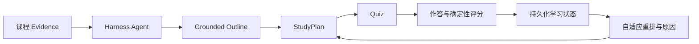

# Learning Helper

把今天的错题，变成明天更有针对性的学习计划。

面向本科生 3–14 天数学分析/微积分备考的学习 Agent。它读取上传的课程资料，生成有出处的解释、课程结构、计划与练习；答题结果持续更新学习状态，并实际调整后续任务。



核心演示：一致连续连续答错两题 → **Weak** → 复习队列 → 计划 **v1 → v2** → 明天增加 **20 分钟复习 + 3 道针对题**。学生能够看到计划为什么改变。

<p>
  
  
</p>

真实 Harness 浏览器截图；课程与答题数据来自确定性演示 fixture。

## 学习体验

- 创建/选择课程，上传 TXT/Markdown，查看就绪状态与去重结果。
- Agent 用七个有边界的工具完成检索、阅读、grounded outline/plan/quiz；引用包含真实讲义段落与行号。
- Harness 原生 Learning 面板：计划、进度、交互 MCQ、提交后解释与刷新恢复。
- 当前开发分支：按计划任务新建学习会话，自动发送带课程目标的开场请求；支持继续学习及展开多个会话。此项尚未进入已发布的 v0.1.0 镜像。
- 当前开发分支：Agent 可读取课程准备阶段和近期练习，按需检索、复用已读证据，并通过精简结果与明确错误提示减少无效操作；边界见 [Agent contract](docs/contracts/agent-tools.md)。尚未部署至发布镜像。
- 确定性评分、Attempt/ConceptState/ReviewQueue、可解释的 PlanRevision；双击与丢失响应重试不重复记账。

功能证明与最终模型/部署验收分别记录在 [验收矩阵](docs/acceptance/matrix.md) 和 [当前状态](docs/CURRENT.md)。普通自动测试不调用外部模型。

## 快速开始

运行壳与部署文件在 [Develata/learning-helper](https://github.com/Develata/learning-helper)：

```bash
git clone https://github.com/Develata/learning-helper.git
cd learning-helper/deploy/learning-helper
docker compose up --build -d
docker compose exec learning-helper node /opt/learning-helper/open.mjs
```

打开最后一条命令返回的本机登录地址，在 Harness 模型设置中配置 provider，随后打开“学习”面板。凭证只在运行时配置，不进入 Git、Dockerfile 或聊天。版本锁、持久化与故障处置见 [部署说明](https://github.com/Develata/learning-helper/blob/master/deploy/learning-helper/README.md)。源码方式见 [本地运行](docs/operations/local-dev.md) / [Harness 集成](docs/operations/harness-integration.md)。

## 原创贡献与复用

Learning Helper 有意作为 DeepSeek Harness plugin 构建，复用成熟 Agent runtime。

| DeepSeek Harness 提供 | Learning Helper 增加 |
|---|---|
| Agent、模型、Session、Tool framework | Evidence → grounded authoring 的业务编排 |
| Web shell、Plugin runtime、Client slots | Course/Plan/Progress/Quiz 学生学习界面 |
| Storage infrastructure | 学习状态不变量、确定性评分与重排策略 |

Agent 用工具推理；`evidence.db` 保存 Source/Chunk/FTS；Harness `state.db` 保存学习事实。LLM 提出 draft，应用层验证并发布；LLM 不写 mastery、不评分，也不覆盖自动修订的计划。发布的 v0.1.0 保持 Harness `packages/`、`apps/` **0 patch**；当前本地品牌分支仅增加已登记的 UI 呈现差异，见 [集成边界](docs/architecture/integrations.md)。插件保持一个独立 npm package，无 sibling checkout 也可 install/build/test/pack。

## 演示与验证

[2–3 分钟演示脚本](docs/DEMO.md) 使用本仓库原创 [讲义](demo/math-analysis/lecture-03.md)。

```bash
pnpm install --frozen-lockfile
pnpm run typecheck
pnpm test
pnpm run build
pnpm demo
pnpm demo:evidence
pnpm demo:authoring
pnpm pack --pack-destination artifacts
pnpm run test:integration -- /absolute/path/to/learning-helper
pnpm acceptance:llm -- /absolute/path/to/learning-helper
```

最后一条使用 Harness 已配置的真实模型，产生需语义审查的本地回执；deterministic tool dispatch 不等于自主模型证明。见 [模型验收](docs/operations/real-llm.md)。

## v0.1 限制

仅 TXT/Markdown；PDF/MinerU/OpenFile 延后。引用/结构校验不等于数学正确性证明，模型输出仍需判断。单用户、本机部署；未提供多用户、外部 PKM、FSRS 或向量服务。普通学生界面和工具卡片在提交前隐藏答案，但原始 session/debug/export 仍可能保留 Agent arguments，不是考试防作弊边界。Quiz 主要显示文本；长篇数学讲解沿用 Harness chat renderer。固定 Harness 的已知传递依赖 advisory 与适用范围见 [发布审查](docs/acceptance/final-delivery.md)，不支持公网共享部署。

业务仓库：[dsh-learning-helper](https://github.com/Develata/dsh-learning-helper)；thin fork：[learning-helper](https://github.com/Develata/learning-helper)。[MIT](LICENSE) · [第三方说明](THIRD_PARTY_NOTICES.md) · [Docs control plane](docs/README.md)。
