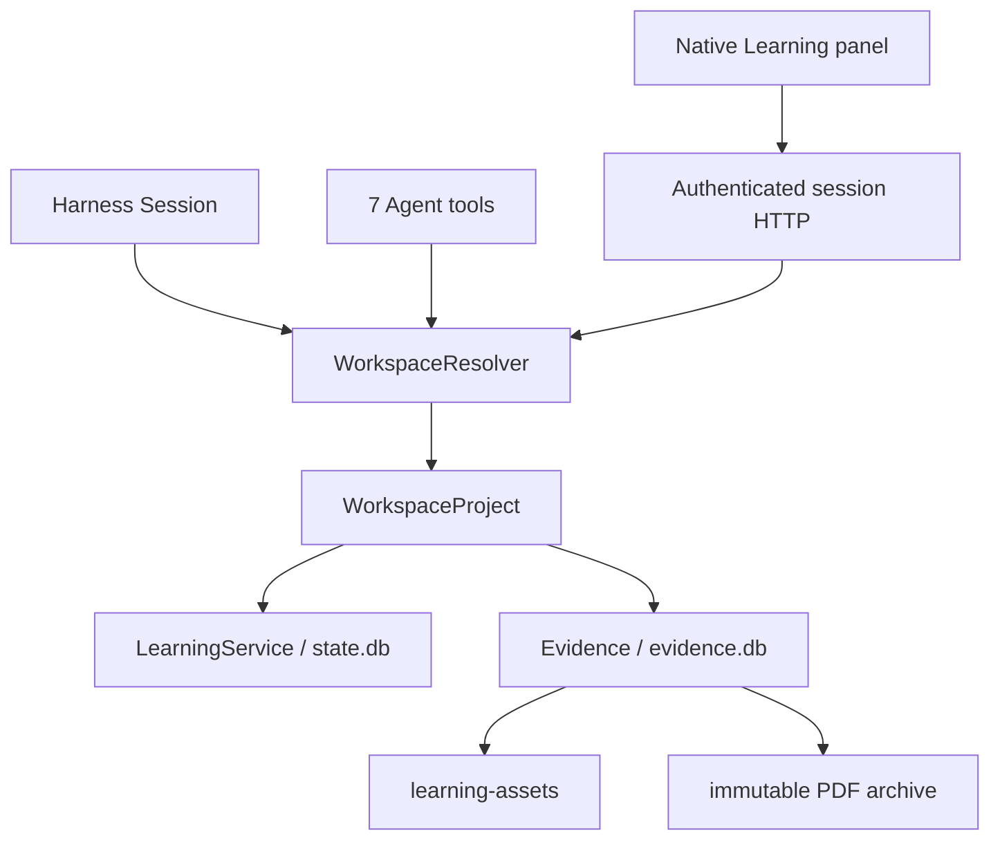

# Workspace 学习能力层（v0.2）

一个 Host/profile 插件实例通过公开 WorkspaceRegistry 的 Session membership 解析每次请求；当前 Harness 没有 workspace-scoped Cordis composition，不模拟该生命周期。

Workspace root 由 Harness 的 canonical path 提供；稳定 projectId 来自 manifest，目录移动不改变它。每个 Workspace 内只有一份学习 aggregate；内部 Course 类型保留，外围没有 Course collection/selector。Evidence 不进入 learner aggregate，答题不读取 corpus。

资料生命周期及持久化分别由 [Evidence](../contracts/evidence.md)、[Persistence](../contracts/persistence.md) 拥有。v0.1 保留在既有 tag，升级必须显式 [迁移](../operations/migration-v1.md)。
